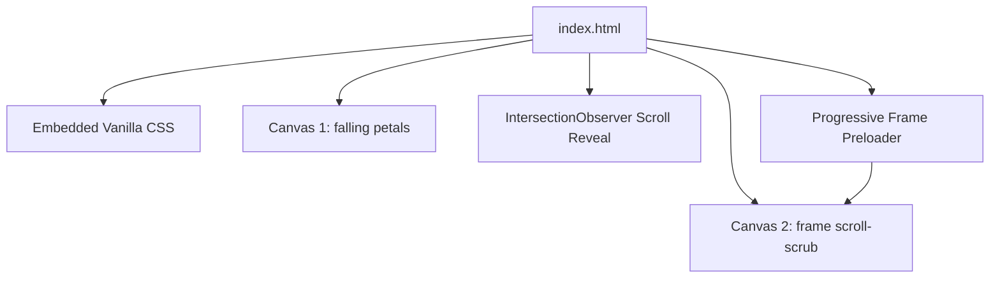

# 🛠️ Velmori Gifts - Developer Reference & Build Specification

This document provides a technical overview of the **Velmori Gifts** codebase. It outlines core architectures, JavaScript systems, CSS structures, and critical guidelines for developers (both human and AI agents) to understand and maintain the project without introducing regressions.

---

## 🏗️ Technical Architecture Overview

Velmori Gifts is designed as an ultra-high performance, single-page, static web experience. 

It does not use a bundler or compiler (Vite/Webpack) to keep load times absolute. Instead, it relies on modern browser APIs to deliver premium animation physics at 60fps on a budget:



---

## ⚡ Core JavaScript Subsystems

### 1. Progressive Animation Frame Preloader (Critical for FCP & 60fps Scrubbing)
To power the canvas-scrub animation, the page renders 240 compressed frames (`ezgif-frame-001.jpg` to `ezgif-frame-240.jpg`). 

To avoid network bottlenecking and eliminate any initial blank screen or scroll stutter, we use a **3-Tier Progressive Preloading & Stride Scrubbing** strategy:
- **Tier 1 (Instant Paint <50ms)**: Preload and decode Frame 1 (`ezgif-frame-001.jpg`) immediately to render the complete hero backdrop on the very first frame.
- **Tier 2 (Keyframe Stride <300ms)**: Load an initial skeleton of keyframes across the entire scroll timeline (every 5th frame = 48 frames total). This gives instant 100% scrub coverage from top to bottom of the page in under half a second.
- **Tier 3 (Background Streaming)**: Stream all remaining intermediate frames in small parallel batches.
- **Nearest-Frame Fallback Interpolation (`getClosestLoadedBitmap`)**: If the user scrolls to a frame index before that specific image completes downloading, the engine instantly draws the closest loaded keyframe rather than stalling, dropping frames, or flashing blank.
- **GPU ImageBitmaps & DPR Capping**: Frames are converted to GPU-resident `ImageBitmap` formats. Canvas device pixel ratio is capped at `1.5` to ensure ultra-smooth 60fps compositing on high-DPI and mobile displays.

### 2. Native Smooth Scroll & Composite Rendering
Scroll scrub behaviors use browser-native passive scroll listeners with zero external momentum dependencies:
- CSS sets native smooth scrolling (`scroll-behavior: smooth`).
- `updateFrame` updates `targetProgress` throttled to `requestAnimationFrame`, redrawing only when frame index shifts.
- Eliminates external CDN bloat (Lenis) and prevents single point of failure when running offline.

---

## 🎨 Layout & CSS Framework Specifications

### Typography Tokens
- **Headings**: `Cormorant Garamond` (classic serif, font-weight: 600, used for luxury branding, large italic headings).
- **Body & Labels**: `Lato` (sans-serif, weights: 300, 400, 700, used for statistics, product body text, navigation elements).

### Glassmorphism System
To maintain the warm luxury card panels, elements utilize CSS backing filters:
```css
background: rgba(255, 255, 255, 0.45);
backdrop-filter: blur(25px) saturate(190%);
-webkit-backdrop-filter: blur(25px) saturate(190%);
border: 1px solid rgba(255, 255, 255, 0.5);
```

---

## 🔍 SEO & Web Vitals Optimizations

### Page Speed Guidelines
1. **Google Web Fonts**: Always connect with a preconnect hint to ensure text doesn't display raw browser styles:
   ```html
   <link rel="preconnect" href="https://fonts.googleapis.com">
   <link rel="preconnect" href="https://fonts.gstatic.com" crossorigin>
   ```
2. **Lazy Loading Assets**: All product images and avatars use standard `loading="lazy"` and `decoding="async"`. DO NOT remove these from the markup.
3. **Canvas Drawing**: Context creation for `frame-canvas` explicitly sets `{ alpha: false }`. This signals to the browser's compositor that the canvas is opaque, optimizing drawing pipelines.

### Search Engine Optimization (SEO)
- **Canonicalization**: The site contains `<link rel="canonical" href="https://velmori-gifts.netlify.app/">`. Keep this updated if the domain shifts.
- **Open Graph Metadata**: Ensure Open Graph and Twitter Card tags correspond to correct asset links (`images/logo.png`) to support rich visual previews on mobile sharing apps.
- **Sitemap**: When adding new pages or anchors, ensure `sitemap.xml` is updated.

---

## ⚙️ Deployment Instructions (Netlify)

This project is configured as a fully static application.

### Netlify Settings
*   **Build Command**: None (leave empty)
*   **Publish Directory**: `.` (root directory)
*   **Headers Configuration**:
    Add cache-control headers on Netlify for images and frame directories (`/frames/*` and `/images/*`) to cache assets aggressively (`max-age=31536000`), reducing repeat load times to zero.

---

## 🛠️ Developer Checklist (Strict Guidelines)

- [ ] **Do not use tailwind or other compilers** unless explicitly requested. Maintain Vanilla CSS within the head block.
- [ ] **Do not modify the frame load batch values** below `15` or above `30` without benchmarking network saturation on 3G speeds.
- [ ] **Alt Tags**: Always provide descriptive `alt` texts on images for search crawler readability.
